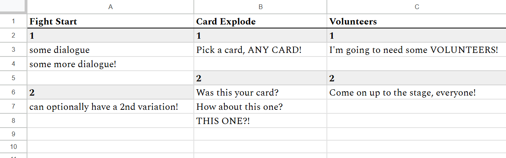

_A system that pulls data from Google Sheets to JSON files, then reads those files into a dictionary for easy use. I often use this for dialogue systems, since Sheets gives you a much better visual display for your script, plus multi-user editing from any device, and then its only a couple clicks to pull that dialogue into the game._

**SHEETS SETUP:**

1) Create a Google Sheet and fill it in with some data. You can edit the code provided to work for different layouts,
but as-written it's expecting the first row to be your headers, with data listed in the columns below. To store multiple
variations under a single header, add a number above each variation.


2) Go to Extensions > Apps Script in the top-left menu bar, and paste the following script:

```Javascript
function doGet() {

  const ss = SpreadsheetApp.getActiveSpreadsheet();
  const sheets = ss.getSheets(); // Get all sheets in the spreadsheet

  let jsonData = {};

  sheets.forEach(sheet => {
    const sheetName = sheet.getName();
    const range = sheet.getDataRange();
    const values = range.getValues();

    // Extract headers from the first row
    const headers = values.shift();

    // Initialize the structure for this sheet
    let sheetData = {};

    // Loop through headers to create top-level keys
    headers.forEach((header, colIndex) => {
      let columnData = {};
      values.forEach((row, rowIndex) => {
        columnData[rowIndex] = row[colIndex]; // Use row index as the key for each entry
      });
      sheetData[header] = columnData;
    });

    // Add this sheet's data to the main JSON object
    jsonData[sheetName] = sheetData;
  });

  // Return JSON
  return ContentService
    .createTextOutput(JSON.stringify(jsonData))
    .setMimeType(ContentService.MimeType.JSON);
}
```

3) Click `Deploy > New Deployment > Select Type > Web App`. Make the project accessible by anyone. Once it finishes, you'll see a
Deployment ID: copy that to your clipboard.


**UNITY SETUP:**

1) Install the Newtonsoft Json package by opening the Package Manager and clicking the plus symbol in the top left > Install package by name,
then typing `com.unity.nuget.newtonsoft-json` as the name.

2) Open the JSONConfig scriptable object and paste the Deployment ID from before in the SheetID field. If you're using multiple scripts,
you'll need to repeat the deploy > paste ID step for each one. You can also create a second JSONConfig if you only want to download some of
these sheets at a time.

3) In the Unity Editor, click `Tools > Download Dialogue`, and enter the JSONConfig you just filled out. If everything is working, you
should get a log saying `"Dialogue for [sheet name] saved to Assets/Resources/Dialogue/[sheet name].json successfully"` (you can change the path
it saves to on line 55 of JSONDownloader.cs). Whenever you change your Google Sheet, just repeat this step to download the newest version.

4) Add an empty GameObject to the scene and attach JSONParser to it. On game start, it'll parse the JSON into a Dictionary structure you can
query with `FindByID()`. Just pass in the sheet name (the name of the tab at the bottom of your Google Sheet), header name, and which variation to find.


**DIALOGUE SETUP (OPTIONAL):**

1) If you want to use this system for dialogue, also add the DialogueManager script to the GameObject you just created, and assign the JSONParser script to
its Parser field.

2) Create a TextMeshPro element, and assign that to the Txt field. If you want a separate dialogue UI to appear whenever text is being typed out, create that and
assign it to the Dialogue Box field. If not, you can assign your TextMeshPro element to that field insted.

3) Tweak the Type Speed field to your liking, with larger numbers corresponding to a slower typing speed.

4) Call `DialogueManager.Instance.PlayByID()` from any other script, using the same parameters as you would for FindByID(), plus a number of seconds to wait
after typing out the text.